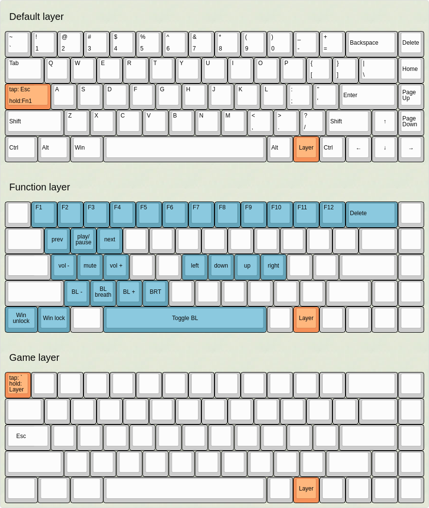

## Custom qmk_firmware tada68 layout
Just some keymap changes over the default tada68 layout using [qmk_firmware](https://github.com/qmk/qmk_firmware/)

### Changes from the default

##### Default layer
- Make the `caps` key send `esc` when tapped and `fn` when hold
- Put the `tilda` key instead of `esc`
- Put the `delete` key instead of `tilda`

##### Function layer
- Add vim-like arrow keys to `hjkl`
- Add `prev` `play/pause` and `next` keys to `qwe`
- Add `volup` `mute` `voldown` volume controls to `asd`
- Add win lock to `Super` key
- Add backlight controls to `zxcv` and `space`

##### Game layer
- Remove `fn` on `esc` hold
- Make `tilda` key send `fn` on hold

### Layout preview

(the json used to generate this preview is on the `KLE` folder on this repo)

### Building firmware
Since this is in a separate repo for now you have to clone it to
`qmk_firmware/keyboards/tada68/keymaps/<name>`

Then run the below command to generate the `FLASH.bin` file
`$ make tada68:<name>:flashbin`

Of course replacing `<name>` with the name you wish to use for the keymap

### Flashing on linux
The automount was not working correctly in some cases but seems to work fine if mounted with the following options (of course replacing the last two args for the correct paths on your system) :

First umount it if it's automatically mounted (was kinda scared to do this tbh since I've heard of people bricking their boards by ejecting on windows without pressing esc but didn't have a problem with so it seems safe)

`sudo umount /dev/sdd`

Remount with the correct options

`sudo mount -t vfat -o rw,nosuid,nodev,relatime,uid=1000,gid=1000,fmask=0022,dmask=0022,codepage=437,iocharset=iso8859-1,shortname=mixed,showexec,utf8,flush,errors=remount-ro,uhelper=udisks2 /dev/sdd /media/TADA68`

Then just copy FLASH.bin to /media/TADA68, confirm the overwrite and press esc.

`cp -r FLASH.bin /media/TADA68`

